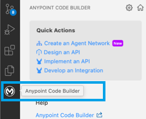

# Create a New API Specification Project

Pour créer un Projet API pour tes specifications dans Anypoint Code Builder, suivre les étapes suivantes:    

1- In the activity bar of the VsCode, click on the icon (M) Anypoint Code Builder, and choose Design an API.   

    

2-👉 Si vous n'etes pas connecté à Anypoint Platform, clicque sur se connecter en bas de l'IDE.     

3-👉 Remplir les onfos du projet:     

| Field Name           | Field Value                                                   |
|----------------------|---------------------------------------------------------------|
| **Enable Agent**     | ☑️Enable this API for Agent Topic and Actions                   |
| **Project Name**     | Donner un nom au projet **sf-case-api**.                      |
| **Project Location** | Mettre tes projets sous c:\src\mule.                          |
| **API Type**         | Selectionner le type de API spec to create: **REST API**.     |
| API Spec Language    | **OAS 3.0 (YAML)**                                            | 
| Business Group (opt) | Selectionner le business groupe mis dans Anypoint **Uprizon** | 

3-👉 Clicque sur leboutton **Create Project**    

Copier et coller les specifications suivantes dans le fichier **sf-case-api.yaml**:    

```.yaml
openapi: 3.0.0
info:
    version: 1.0.0
    title: sf-case-api
    description: >
        API d'accès à l'objet Salesforce Case.
        Permet de créer un Case (avec un RecordType constant et des champs fixes
        appliqués côté serveur) et de récupérer un Case existant par son Id Salesforce.
tags:
    - name: Case
      description: Opérations sur l'objet Salesforce Case
paths:
    /cases:
        post:
            operationId: createCase
            summary: Créer un Case Salesforce
            description: >
                Crée un nouvel enregistrement Case dans Salesforce.
                Le RecordType ainsi que certains champs fixes sont appliqués
                automatiquement côté serveur et ne sont pas fournis par le client.
            tags:
                - Case
            requestBody:
                required: true
                content:
                    application/json:
                        schema:
                            $ref: '#/components/schemas/CaseInput'
            responses:
                '201':
                    description: Case créé avec succès
                    content:
                        application/json:
                            schema:
                                $ref: '#/components/schemas/CaseInsertResult'
                '400':
                    description: Requête invalide
                    content:
                        application/json:
                            schema:
                                $ref: '#/components/schemas/Error'
                '500':
                    description: Erreur serveur ou Salesforce
                    content:
                        application/json:
                            schema:
                                $ref: '#/components/schemas/Error'

    /cases/{caseId}:
        parameters:
            - name: caseId
              in: path
              required: true
              description: Id Salesforce (18 caractères) de l'enregistrement Case
              schema:
                  type: string
                  minLength: 15
                  maxLength: 18
                  example: 500XXXXXXXXXXXXXXX
        get:
            operationId: getCaseById
            summary: Récupérer un Case Salesforce par Id
            description: Retourne l'enregistrement Case correspondant à l'Id Salesforce fourni.
            tags:
                - Case
            responses:
                '200':
                    description: Case trouvé
                    content:
                        application/json:
                            schema:
                                $ref: '#/components/schemas/Case'
                '404':
                    description: Case non trouvé
                    content:
                        application/json:
                            schema:
                                $ref: '#/components/schemas/Error'
                '500':
                    description: Erreur serveur ou Salesforce
                    content:
                        application/json:
                            schema:
                                $ref: '#/components/schemas/Error'

components:
    schemas:
        CaseInput:
            type: object
            description: >
                Champs saisis par le client pour la création du Case.
                Le RecordTypeId et les autres champs fixes sont ajoutés par l'API.
            required:
                - subject
            properties:
                subject:
                    type: string
                    description: Objet du Case (champ Salesforce Subject)
                    example: Demande d'information
                description:
                    type: string
                    description: Description détaillée du Case (champ Salesforce Description)
                origin:
                    type: string
                    description: Origine du Case (champ Salesforce Origin)
                    example: Web
                priority:
                    type: string
                    description: Priorité du Case (champ Salesforce Priority)
                    enum:
                        - Low
                        - Medium
                        - High
                accountId:
                    type: string
                    description: Id Salesforce du compte (Account) associé
                    example: 001XXXXXXXXXXXXXXX
                contactId:
                    type: string
                    description: Id Salesforce du contact associé
                    example: 003XXXXXXXXXXXXXXX
                suppliedEmail:
                    type: string
                    format: email
                    description: Email du demandeur (champ Salesforce SuppliedEmail)
                suppliedName:
                    type: string
                    description: Nom du demandeur (champ Salesforce SuppliedName)
                suppliedPhone:
                    type: string
                    description: Téléphone du demandeur (champ Salesforce SuppliedPhone)
            example:
                subject: Demande d'information
                description: Le client souhaite obtenir plus d'informations sur le produit.
                origin: Web
                priority: Medium
                accountId: 001XXXXXXXXXXXXXXX
                contactId: 003XXXXXXXXXXXXXXX
                suppliedEmail: jean.dupont@example.com
                suppliedName: Jean Dupont
                suppliedPhone: '+33612345678'

        CaseInsertResult:
            type: object
            description: Résultat minimal retourné après la création du Case
            required:
                - id
                - success
            properties:
                id:
                    type: string
                    description: Id Salesforce du Case créé
                    example: 500XXXXXXXXXXXXXXX
                success:
                    type: boolean
                    description: Indique si la création a réussi
                    example: true

        Case:
            type: object
            description: Enregistrement Case Salesforce complet
            properties:
                id:
                    type: string
                    description: Id Salesforce du Case
                    example: 500XXXXXXXXXXXXXXX
                caseNumber:
                    type: string
                    description: Numéro de Case Salesforce (CaseNumber)
                    example: '00001234'
                recordTypeId:
                    type: string
                    description: Id du RecordType appliqué au Case
                subject:
                    type: string
                    description: Objet du Case
                description:
                    type: string
                    description: Description du Case
                status:
                    type: string
                    description: Statut du Case
                    example: New
                origin:
                    type: string
                    description: Origine du Case
                priority:
                    type: string
                    description: Priorité du Case
                    enum:
                        - Low
                        - Medium
                        - High
                accountId:
                    type: string
                    description: Id Salesforce du compte associé
                contactId:
                    type: string
                    description: Id Salesforce du contact associé
                suppliedEmail:
                    type: string
                    format: email
                    description: Email du demandeur
                suppliedName:
                    type: string
                    description: Nom du demandeur
                suppliedPhone:
                    type: string
                    description: Téléphone du demandeur
                createdDate:
                    type: string
                    format: date-time
                    description: Date de création du Case
                lastModifiedDate:
                    type: string
                    format: date-time
                    description: Date de dernière modification du Case
            example:
                id: 500XXXXXXXXXXXXXXX
                caseNumber: '00001234'
                recordTypeId: 012XXXXXXXXXXXXXXX
                subject: Demande d'information
                description: Le client souhaite obtenir plus d'informations sur le produit.
                status: New
                origin: Web
                priority: Medium
                accountId: 001XXXXXXXXXXXXXXX
                contactId: 003XXXXXXXXXXXXXXX
                suppliedEmail: jean.dupont@example.com
                suppliedName: Jean Dupont
                suppliedPhone: '+33612345678'
                createdDate: '2026-07-08T10:15:00.000+00:00'
                lastModifiedDate: '2026-07-08T10:15:00.000+00:00'

        Error:
            type: object
            required:
                - message
            properties:
                message:
                    type: string
                    description: Message d'erreur
                errorCode:
                    type: string
                    description: Code d'erreur (ex. code d'erreur Salesforce)
```


[Document de référence](https://docs.mulesoft.com/anypoint-code-builder/des-designing-api-specs)    

