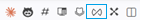
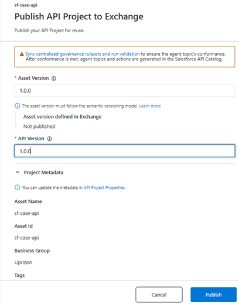
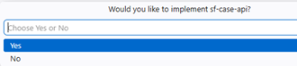
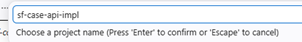
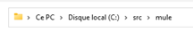

# Publish API Spec to Exchange    

## Pour publier l'API Spec dans Exchange, suivre les étapes suivantes:    
1-👉 S'assurer que la connection vers Anypoint platform est bien établie, ton nom **dev name** est bien présent en bas l'IDE.    
2-👉 Cliquer sur l'icon "Publish API Project to Exchange".    
    

3-👉 renseigner la version 1.0.0 et cliquer sur le boutton "Publish"      
    

Le projet est publié maintenant dans Anypoint Exchange. 

4-👉 L'IDE VsCode va enchainner par des questions pour créer l'implementation du projet (mais on peut créer l'implementation en 2eme étape separé).

Si on veut suivre l'implementation, il faut choisir les réponses suivantes:    

Would you like to implement sf-case-api?     
    
Choose a project name (Press "Enter")     
        
Choose a project location     
    

[Document de référence](https://docs.mulesoft.com/anypoint-code-builder/des-publish-api-spec-to-exchange)   
