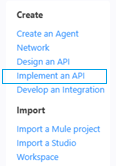
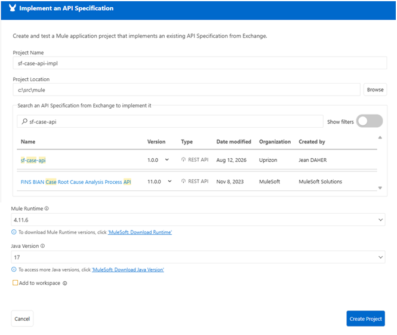
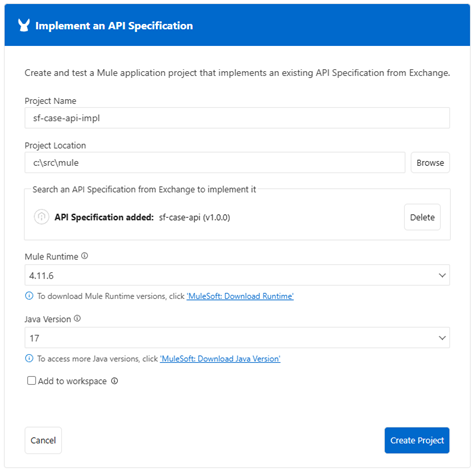

# API implementation 

## Scaffold API à partir de API Spec de Exchange et créer Projet Mule Implementation.


Importer et Scaffolding an API Specification into Mule App.    

1-👉 A partir de Create, clique sur "Implement an API":   
    

2-👉 Specifier project name, location dans le "Develop an Integration form".    
    

3-👉 Remplir les infos du projet:     

| Field Name           | Field Value                                                   |
|----------------------|---------------------------------------------------------------|
| **Project Name**     | Donner un nom au projet **sf-case-api-impl**.                 |
| **Project Location** | Mettre tes projets sous c:\src\mule.                          |
| **Search an API Specification from Exchange** | Mettre sf-case-api                          |


4-👉 Le click sur Search, va chercher les API de Exchange 
Identifier l'API sf-case-api et cliquer sur le button "Add Asset" 

5-👉 Cliquer sur le boutton "Create Project"    
   

Quand le projet est crée, ACB ajout dans le pom.xml sous le tag dependencies l'element suivant (liens exchange de l'API spec):

```.xml
        <dependency>
            <groupId>7d72da87-5573-41ad-90c4-2100245afb7d</groupId>
            <artifactId>sf-case-api</artifactId>
            <version>1.0.0</version>
            <classifier>oas</classifier>
            <type>zip</type>
        </dependency>
```    

Comme on a vu, il met les elements de Exchange concernant l'API sf-case-api dans le pom sous dependencies.    

On va trouver ces élements dans le fichier xml de flow avec le tag apikit:
```.xml
 <apikit:config name="sf-case-api-config" api="resource::7d72da87-5573-41ad-90c4-2100245afb7d:sf-case-api:1.0.0:oas:zip:sf-case-api.yaml" outboundHeadersMapName="outboundHeaders" httpStatusVarName="httpStatus" />
```      

## Ajouter les propriétés des environnements    


## Ajouter la logique métier aux different flus du projet    


[Doc.Ref: Implementationing api](https://docs.mulesoft.com/anypoint-code-builder/imp-implementing-apis)    
[Doc.Ref: Securisé les propriétés api](https://docs.mulesoft.com/anypoint-code-builder/imp-implementing-apis)    

