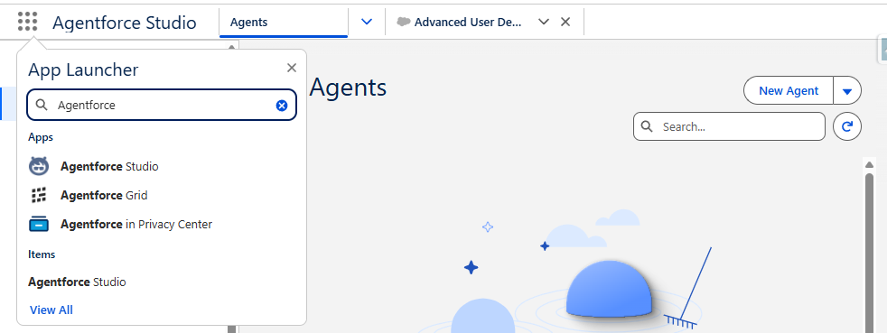

# Agentforce Builder 

## 1. agentforce license 

* Verify you have the Service-Agent add-on (see the licenses `Agentforce` in Company Information).         
* Activate Einstein in SF org:  Setup / `Salesforce Go`, Turn on `Einstein toggle` and `Prompt Builder Settings`    

## 2. Newt Agentforce Builder 

* Search & Choose the application :  App Launcher → Agentforce Studio 
* Click on ` + New Agent`    [You can create it from script `</>` see last §]

