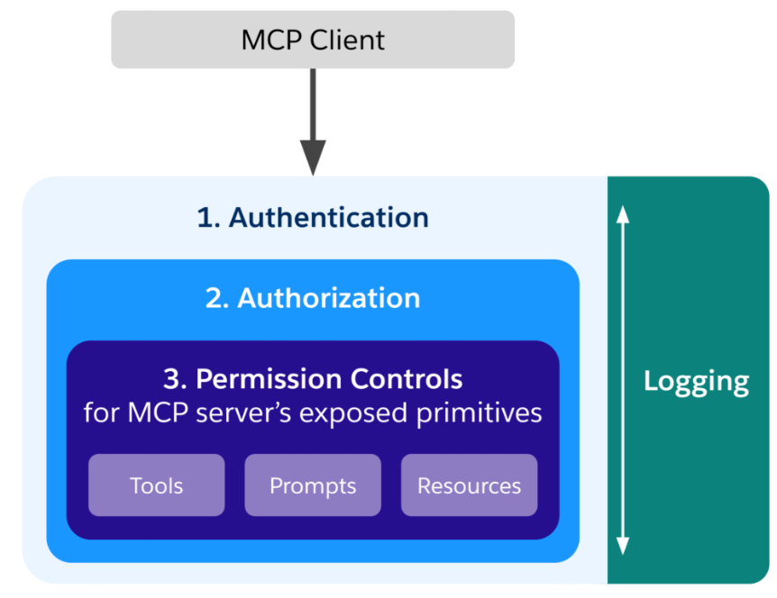
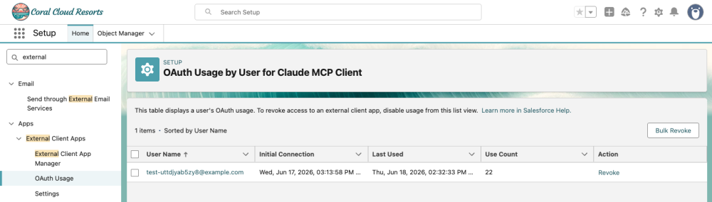
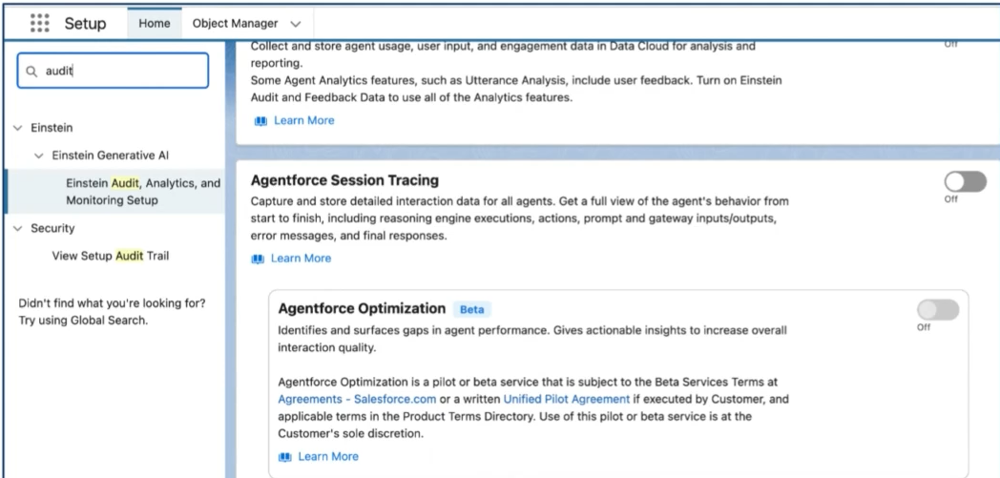

# 📘 Salesforce Hosted MCP Server security model

The Salesforce MCP security model has three layers:
* **Authentication**: Verifies who’s making the request **“Who are you?”**    
* **Authorization**: Determines what they’re allowed to do **“What the user can do?”** 
* **Permission controls**: Enforce granular access at the object and field level when working with the primitives (tools, prompts and resources) exposed by the server



Je voudrais mettre 3 rectangle imbriqués avec les titres :
"Authentication" couleur cyan,  "Authorization" couleur cyan foncé , puis  "Permission Controls" couleur cyan tres foncé proche du bleu.

## 0. Salesforce Elements
  
| Element                | Description                                  |
|------------------------|----------------------------------------------|
|MCP_Client_ECA          | authorization code flow                      |
|                        | OAuth policies, Permitted Users =>           |
|                        | Admin approved users are pre-authorized.     |
|MCP_Client_PermSet      | “`Manage user data via APIs (api)`”          |


## 1. ECA config:
* authorization code flow
* OAuth policies, Permitted Users => Admin approved users are pre-authorized.

📌 “The Authorization Code Flow is an OAuth process where the user signs in to Salesforce through the browser, and Salesforce then sends a temporary code back to your application, which exchanges it for an `access_token` or a `refresh_access_token`.

📌 Using OAuth 2, control with Salesforce ECA External Client App.    
We strongly recommend creating a **dedicated ECA per MCP client** (one for Claude, one for ChatGPT, one for Cursor, etc.) rather than sharing a single ECA across multiple clients. 
 
## 2. System permissions
* Create permissionSet `MCP Client PermSet`.   or replace the word Client by the agent name suc as FieldDependencies: `MCP FieldDependencies PermSet`
* Give this permissionSet the permission : “`API Enabled`” and  “`Manage user data via APIs (api)`”
this will grant full access to the Platform APIs **(REST, Tooling, Metadata, etc.)** 


## 3. MCP Monitoring access  
You can see usage or/revoke access from Setup/External Client App , then OAuth Usage.


📌 ATTENTION: by default Token Revoked after 30 days. defined for 365 days. 
 

 ## 3. User for agent 
 The user associated to Agent should have the following:
* put "`DigitalAgent`" as first name 
* license `Agentforce User`
* System permission: API Enabled

## 4. Enable Trace 
* Setup -> "Enstein Audit, Analytics and Monitoring Setup" -> "Agentforce Session Tracing" -> Enable toggle  



## 5. Example of Queries using agent

```
SELECT * FROM "ssot__AiAgentSession__dim" JOIN
"ssot__AiAgentSessionParticipant__dim" ON 
"ssot__AiAgentSession__dim"."ssot__id__c" =   
"ssot__AiAgentSessionParticipant__dim"."ssot__aiAgentSessionId__c" JOIN  "ssot__AiAgentSessionParticipant__dim"
```


[Move Agent from env to PROD using SF]( 
https://developer.salesforce.com/docs/ai/agentforce/guide/agent-dx-deploy-metadata.html?utm_source=copilot.com)

[Reference Document](https://developer.salesforce.com/blogs/2026/06/how-to-secure-salesforce-hosted-mcp-servers?via=dailydev)    

